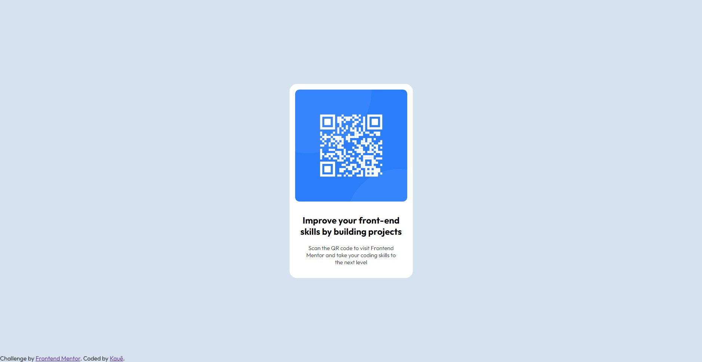

# Frontend Mentor - QR code component solution

This is a solution to the [QR code component challenge on Frontend Mentor](https://www.frontendmentor.io/challenges/qr-code-component-iux_sIO_H). Frontend Mentor challenges help you improve your coding skills by building realistic projects. 

## Table of contents

  - [Screenshot](#screenshot)
  - [Links](#links)
  - [Built with](#built-with)
  - [Continued development](#continued-development)
  - [Author](#author)

**Note: Delete this note and update the table of contents based on what sections you keep.**

### Screenshot

### Links

- Solution URL: [Click Here](https://github.com/kauevecchia/qrcode-page)
- Live Site URL: [Click Here](https://kauevecchia.github.io/qrcode-page/)

## My process

### Built with

- HTML5
- CSS3
- Flexbox

### Continued development

I want to continue focusing on my CSS abilities in my future projects and challenges on FrontEnd Mentor, mainly flexbox, media query, css grid, etc. 

## Author

- Website - [Kauê](https://github.com/kauevecchia)
- Frontend Mentor - [@yourusername](https://www.frontendmentor.io/profile/yourusername)

